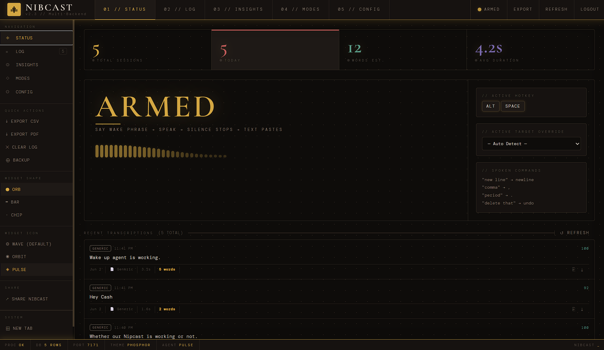
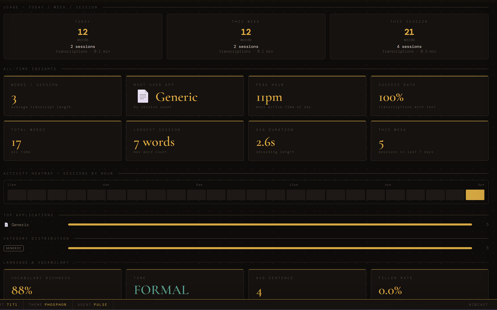
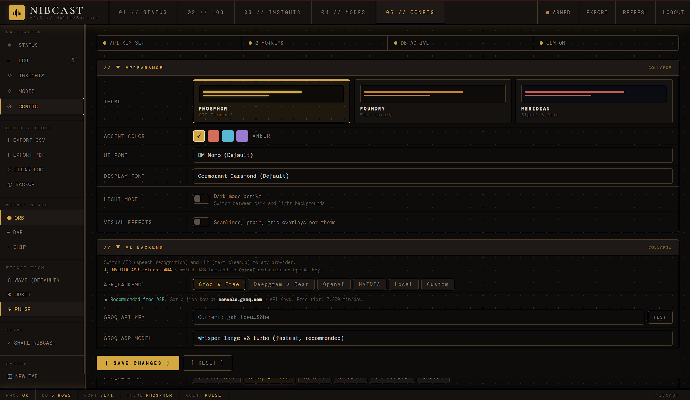

# NibCast

> AI-powered voice dictation for Windows — speak anywhere, paste instantly. No subscription, no cloud lock-in.

[](LICENSE)
[](https://www.python.org/)
[]()
[](https://github.com/NibCast/nibcast/actions)

Privacy-first: no NibCast servers and no telemetry. The app runs on your machine;
your speech is sent only to the ASR/LLM provider **you** choose, using **your own**
API keys. See [PRIVACY.md](PRIVACY.md) for the full data-flow.

---

## What It Does

Press a hotkey (or say a wake phrase) → speak → your words appear in any app. An LLM silently cleans the transcript — fixing filler words, capitalisation, and punctuation — before pasting.

---

## Features

| Category | Features |
|----------|---------|
| **Activation** | Hold-to-talk, tap-to-toggle, wake-word (hands-free), click the widget |
| **ASR** | Groq Whisper (free), OpenAI, Deepgram Nova-3, local whisper.cpp, custom endpoint |
| **LLM** | Groq (free), Cerebras (free), Gemini (free), OpenAI, Anthropic Claude, Ollama (local/offline), NVIDIA NIM, custom |
| **Brain Mode** | Run two ASR (or LLM) engines in parallel and keep the best-scoring result — higher accuracy (opt-in; single-engine Groq stays free) |
| **LLM failover** | If your primary LLM is rate-limited (e.g. Groq's free daily cap) or errors, auto-retry cleanup on a fallback provider you choose — opt-in, never silent |
| **Custom dictionary** | Teach it your names, jargon & product terms — biases both transcription *and* LLM cleanup, so "cloud code" → "Claude Code" |
| **Wake word** | Fuzzy Jaro matching, phonetic alternatives, two-phase VAD state machine, mic-gain-adaptive thresholds |
| **Voice Match** | Optional speaker verification (off by default) — lock dictation to your enrolled voice; adjustable match strictness |
| **Per-app smarts** | Learns vocabulary per application; different formatting rules per window type |
| **Widget** | 3 shapes (Orb, Bar, Chip) × 3 icon styles × 3 colour themes, draggable, live-switch |
| **Tray** | Background mode, toggle widget, show/hide from right-click menu |
| **Dashboard** | Full web UI at `localhost:7171` — opens as a native app window; stats, log, insights, all settings |
| **Auth** | PIN / draw-pattern / TOTP (Google Authenticator) with brute-force limiting |
| **Language** | Auto-detect 99 languages; optional translate-to-English mode |
| **Usage stats** | Per-day / per-week / per-session word count and transcription count |
| **Fidelity score** | Optional per-entry score showing how closely the injected text matches what was spoken |
| **Privacy** | Privacy mode (no history logging), local SQLite only, auto-delete old entries |
| **Diagnostics** | One-click scrubbed Debug Bundle — redacted config + system info + recent log for bug reports (API keys never included) |
| **Export** | CSV + PDF (date-grouped, timestamped entries) |
| **Startup** | Optional Windows login auto-start; minimised/background mode |

> 📖 For a full guided tour of every capability, see **[FEATURES.md](FEATURES.md)**.

---

## Screenshots

| Status & Wake Word | Insights & Usage | Config & Appearance |
|-------------------|-----------------|---------------------|
|  |  |  |

---

## Quick Start

### Download the .exe (easiest — no Python needed)

1. Download and unzip `NibCast-windows.zip` from [Releases](https://github.com/NibCast/nibcast/releases) — keep `NibCast.exe` next to its `_internal/` folder
2. Double-click `NibCast.exe`

   - **SmartScreen warning?** Click **More info → Run anyway**. The exe is unsigned but you can inspect/build the source yourself.
   - **Won't start / crashes immediately?** See [Troubleshooting](#troubleshooting) below.
3. Browser opens automatically to `localhost:7171` — set a PIN → enter your free Groq API key → press `Ctrl+Alt+V` and speak

### From source (one-click)

1. Double-click **`setup.bat`** — creates venv, installs deps, creates desktop shortcut
2. Visit `http://localhost:7171` → set a PIN → enter your Groq API key
3. Press `Ctrl+Alt+V` and speak

**First time?** A Groq API key is free — takes 30 seconds at [console.groq.com](https://console.groq.com) → API Keys. NibCast uses ~10 seconds of Groq quota per transcription against a 7,200 min/day free tier.

### Manual

```bash
git clone https://github.com/NibCast/nibcast
cd nibcast
python -m venv venv && venv\Scripts\activate
pip install -r requirements.txt
python main.py
```

### Background mode (no UI)

```bash
python main.py --minimized
```

No floating widget, no browser tab. Only the system tray icon. Right-click → **Toggle Widget** to show the orb later. Enable at login via Dashboard → Config → Startup.

### Native desktop window

By default NibCast opens the dashboard in a clean, chromeless **app window**
(Chrome/Edge `--app` mode) — no tabs, no address bar. For a **true frameless OS
window** with its own custom titlebar (minimise / maximise / close), a draggable
header, and a taskbar entry, install pywebview and use the desktop launcher:

```bash
pip install pywebview
python desktop_app.py
```

Both modes serve the same dashboard — pick whichever feels more native. (Without
pywebview, `desktop_app.py` falls back to the Chrome `--app` window automatically.)

---

## First-Time Checklist

After `setup.bat` completes:

- [ ] Open `http://localhost:7171` and set your PIN
- [ ] Go to **Config → AI Backend** and paste your Groq API key
- [ ] Click **Test All** to confirm the key works
- [ ] Press `Ctrl+Alt+V`, speak a sentence, and verify text appears in the focused app
- [ ] If nothing appears: check the mic level meter (Config → Wake Phrase) and ensure Windows has microphone access for Python (`Settings → Privacy → Microphone`)
- [ ] Optional: enable **Run at startup** so NibCast starts with Windows

---

## Architecture

```
┌─────────────────────────────────────────────────────────────────┐
│                       NibCast                           │
│                                                                 │
│  Input layer                                                    │
│  ┌──────────────┐   ┌──────────────────┐   ┌────────────────┐  │
│  │HotkeyListener│   │  VoiceActivator  │   │ FloatingWidget │  │
│  │  (pynput)    │   │ (VAD, asym. EMA) │   │  (tkinter orb) │  │
│  └──────┬───────┘   └────────┬─────────┘   └────────────────┘  │
│         │                    │                                   │
│         └──────────┬─────────┘                                  │
│                    ▼                                             │
│  ┌─────────────────────────────────────────────────────────┐    │
│  │              AudioRecorder (sounddevice)                 │    │
│  │  • One shared InputStream (avoids WASAPI conflicts)      │    │
│  │  • Pre-roll buffer (~0.47 s) for VAD onset capture       │    │
│  │  • Level hooks → /api/mic-level (calibration UI)        │    │
│  └─────────────────────┬───────────────────────────────────┘    │
│                         │ WAV bytes                              │
│                         ▼                                        │
│  ┌─────────────────────────────────────────────────────────┐    │
│  │                  Transcriber (ASR)                       │    │
│  │  Groq │ OpenAI │ Deepgram │ Local │ Custom               │    │
│  │  Brain Mode: 2 engines in parallel → keep best result    │    │
│  └─────────────────────┬───────────────────────────────────┘    │
│                         │ raw text                               │
│                         ▼                                        │
│  ┌─────────────────────────────────────────────────────────┐    │
│  │                 TextProcessor (LLM)                      │    │
│  │  Groq │ Cerebras │ Gemini │ OpenAI │ Claude │ Ollama │   │    │
│  │  NVIDIA │ Custom                                         │    │
│  │  Writing style │ voice commands │ snippets │ Brain Mode   │    │
│  └─────────────────────┬───────────────────────────────────┘    │
│                         │ clean text                             │
│                         ▼                                        │
│  ┌─────────────────────────────────────────────────────────┐    │
│  │               TextInjector → target app                  │    │
│  │  clipboard paste │ pyautogui type │ preserve clipboard   │    │
│  └─────────────────────────────────────────────────────────┘    │
│                                                                 │
│  ┌─────────────────────────────────────────────────────────┐    │
│  │          Flask Dashboard  (localhost:7171)               │    │
│  │  Status │ Log │ Insights │ Modes │ Config                │    │
│  │  Auth: PIN / Pattern / TOTP                              │    │
│  └─────────────────────────────────────────────────────────┘    │
└─────────────────────────────────────────────────────────────────┘
```

---

## Wake-Word State Machine

```
┌─────────────────────────────── PHASE 1: SLEEP ──────────────────────────────┐
│  All audio → asymmetric EMA (attack α=0.7, release α=0.15)                  │
│  If smoothed RMS > WAKE_WORD_VAD_THRESHOLD (default 0.03):                  │
│    → Record short clip (max 3 s, pre-roll included)                          │
│    → ASR: whisper-large-v3 (accurate short-clip model)                       │
│    → _match_wake_word() — 3-layer fuzzy matching:                            │
│        1. Exact word match in first 3 words                                  │
│        2. Suffix match (Whisper dropped leading word)                        │
│        3. Jaro phonetic match; for 2-word phrases the *content* word         │
│           must clear WAKE_WORD_FUZZY_THRESHOLD (0.80) so "hey ___"           │
│           near-misses (e.g. "hey Fowler") don't false-trigger               │
│    → No match → discard, short cooldown, repeat                              │
└──────────────────────────────────────┬──────────────────────────────────────┘
                                        │ Match confirmed
┌──────────────────────────────────────▼──────────────────────────────────────┐
│                            PHASE 2: COMMAND                                  │
│  Widget → teal "READY" glow + ding tone                                      │
│  VAD threshold drops to VOICE_VAD_THRESHOLD (0.030) — more sensitive         │
│  No clip length cap — user may dictate freely                                │
│  Safety timer: if no speech within 8.5 s → auto-return to sleep             │
│  On silence detected → ASR (turbo) → LLM → inject → return to sleep         │
└─────────────────────────────────────────────────────────────────────────────┘
```

### Tuning the wake-word threshold

The default `WAKE_WORD_VAD_THRESHOLD = 0.03` works for most microphones. If your wake phrase is not detected:

1. Open Dashboard → Config → Wake Phrase → watch the **Mic Level** meter
2. Speak your wake phrase — note the peak RMS shown
3. Set threshold **20% below** that peak, or click **Calibrate** while speaking
4. If background noise triggers false detections, raise the threshold slightly

The wake gate also **floats above the measured ambient noise floor automatically**, so a loud room (or a hot mic) stops false-triggering even before you touch the threshold, and **command-mode silence detection adapts to your mic's noise floor** so quiet mics aren't cut off mid-sentence. Configured thresholds are honored up to a hard ceiling of `0.30` (`WAKE_WORD_VAD_THRESHOLD_MAX`) — a corrupt-config guard only. If your phrase still isn't detected, lower `WAKE_WORD_VAD_THRESHOLD` toward `0.02`; if background audio keeps triggering recordings, raise it above the Mic Level meter's idle reading, or lower your microphone's input level in Windows Sound settings.

---

## ASR Backends

| Backend | Model | Free Tier | Latency |
|---------|-------|-----------|---------|
| **Groq** (recommended) | whisper-large-v3-turbo | 7,200 min/day | ~300 ms |
| **Groq wake** | whisper-large-v3 | same quota | ~500 ms |
| **OpenAI** | whisper-1 | Paid | ~800 ms |
| **Deepgram** | nova-3 | 12,000 min/month | ~200 ms |
| **Local** | any Whisper | Unlimited | depends on GPU |
| **Custom** | any OpenAI-compat. | varies | — |

---

## LLM Backends

| Backend | Recommended model | Free |
|---------|------------------|------|
| **Groq** (recommended) | llama-3.3-70b-versatile | ✓ (rate-limited) |
| **Cerebras** | llama-3.3-70b | ✓ (1M tokens/day) |
| **Gemini** | gemini-2.5-flash | ✓ (Flash tier)¹ |
| **Ollama** | llama3.2, mistral | ✓ (local) |
| **Anthropic** | claude-3-5-haiku-20241022 | Paid |
| **OpenAI** | gpt-4o-mini | Paid |
| **NVIDIA NIM** | llama-3.1-8b-instruct | Free credits |

¹ **Privacy:** Google's *free* Gemini tier may use your dictated text to improve its
products. For private dictation use a paid Gemini key, or pick Groq/Cerebras. The same
caveat applies to most no-credit-card free tiers — see [PRIVACY.md](PRIVACY.md).

> 🔁 **Never get stuck on a rate limit.** Set **Config → AI Backend → `LLM_FALLBACK`** to a
> second free provider (e.g. primary **Groq** → fallback **Cerebras**). If your primary hits
> its daily cap (HTTP 429), NibCast retries cleanup on the fallback instead of dropping to
> basic cleanup. Opt-in — it never silently switches providers.

---

## Hotkeys (default)

| Combo | Mode | Use |
|-------|------|-----|
| `Ctrl+Alt+V` | Hold | Quick dictation — hold while speaking, release to paste |
| `Ctrl+Alt+Space` | Toggle | Hands-free — press to start, press again to paste |
| `Ctrl+Shift+Space` | Command | Select text + hold to speak an LLM editing instruction |
| `Scroll Lock` | Hold | Alternative hold-to-talk key |

All combos configurable in dashboard. Multiple hotkeys run in parallel.

---

## Settings Reference

### Startup

| Setting | Description | Default |
|---------|-------------|---------|
| `START_MINIMIZED` | Launch without widget/dashboard | `false` |
| `SHOW_WIDGET_ON_START` | Show floating orb on launch | `true` |
| Run at login | Windows registry auto-start (Dashboard toggle) | off |

### Audio Cues

| Setting | Description |
|---------|-------------|
| `AUDIO_CUE_START` | Ding when recording begins |
| `AUDIO_CUE_STOP` | Ding when recording ends |
| `AUDIO_CUE_ERROR` | Buzz on error |

### Widget

| Setting | Values |
|---------|--------|
| `WIDGET_SHAPE` | `orb` (round) / `bar` (horizontal pill) / `chip` (minimal dot) |
| `WIDGET_STYLE` | `wave` / `orbit` / `pulse` — icon drawn inside the widget |
| `WIDGET_THEME` | `amber` / `violet` / `cyan` — colour palette |

All three can be changed live from the dashboard sidebar without restarting.

### Language & Translation

| Setting | Description | Default |
|---------|-------------|---------|
| `LANGUAGE` | `""` = auto-detect (99 languages), or ISO code e.g. `"en"`, `"es"`, `"hi"` | `"en"` |
| `TRANSLATE_TO_ENGLISH` | Translate speech in any language to English text | `false` |

### Wake Word & Voice Match

| Setting | Description | Default |
|---------|-------------|---------|
| `WAKE_WORD` / `WAKE_WORD_ENABLED` | The hands-free trigger phrase and on/off | `""` / off |
| `WAKE_WORD_FUZZY_THRESHOLD` | Min Jaro similarity for the content word of a 2-word phrase (higher = stricter, fewer false wakes) | `0.80` |
| `WHISPER_PROMPT` | **Custom dictionary** — comma-separated names/jargon/product terms. Biases both the transcriber and the cleanup LLM toward these spellings (e.g. "cloud code" → "Claude Code") | (starter set) |
| `VOICE_ENROLLMENT_ENABLED` | Require your enrolled voice for commands (speaker verification). **Off by default** — opt in only if you want to lock dictation to one voice | `false` |
| `VOICE_SIMILARITY_THRESHOLD` | How closely a command must match your enrolled voice. **Lower if your own commands keep getting rejected;** higher to block more impostors | `0.50` |

Both are adjustable in **Config → Wake Word** (match-strictness slider + "Require my voice" toggle) — no need to edit `config.json`.

### Brain Mode

| Setting | Description | Default |
|---------|-------------|---------|
| `BRAIN_MODE` | Run a 2nd backend in parallel and keep the best-scoring result | `false` |
| `ASR_BRAIN_SECONDARY` | The 2nd ASR engine. For a real accuracy gain pick a *different* engine than your primary (e.g. Groq Whisper + Deepgram nova-3) | `deepgram` |

### Privacy & Data

| Setting | Description | Default |
|---------|-------------|---------|
| `PRIVACY_MODE` | No history logging, no text in logs | `false` |
| `CONTEXT_AWARENESS` | Use active-window app for vocab hints | `true` |
| `HISTORY_AUTO_DELETE_DAYS` | Auto-delete entries older than N days (0=never) | `0` |

---

## Privacy & Security

- Audio is **never stored to disk** by NibCast — only the final text transcript
- **Where your speech goes:** to use a cloud backend, your audio is sent to the
  ASR provider you select (Groq / OpenAI / Deepgram) and your transcript to the
  LLM provider you select (Groq / Cerebras / Gemini / OpenAI / NVIDIA / Anthropic /
  Ollama). That data is handled under **that provider's** privacy policy and
  retention terms — not NibCast's. **Note:** some providers' *free* tiers (e.g.
  Google Gemini) may train on your input — see [PRIVACY.md](PRIVACY.md). Choose a
  local backend (Whisper / Ollama) to keep everything offline.
- All processing uses **your own API keys** — there is no NibCast cloud or server
- **No telemetry or analytics** — NibCast collects nothing about you. The only
  request NibCast itself makes is an optional GitHub version check at startup
- Dashboard fonts are **self-hosted** — the UI loads nothing from third parties
- Dashboard is **localhost-only**, protected by PIN / pattern / TOTP
- Credentials live in `~/.nibcast/` — never committed to source control
- Privacy mode: transcript text excluded from all logs and history

See [PRIVACY.md](PRIVACY.md) for the full data-flow and [LICENSE](LICENSE) for terms.

---

## Export Options

- **CSV** — Dashboard → Export CSV — all fields, spreadsheet-compatible
- **PDF** — Dashboard → Export PDF — day-grouped, timestamped, readable by humans
  - Each day gets its own section with time, app, and transcript per entry
  - Requires `pymupdf`: `pip install pymupdf`

---

## Project Structure

```
nibcast/
├── main.py              Entry point + pipeline orchestration
├── desktop_app.py       Optional native-window launcher (pywebview, frameless)
├── config.py            Layered config: defaults → JSON → env vars
├── voice_activator.py   VAD with asymmetric EMA (fast attack / slow release)
├── audio_recorder.py    Shared sounddevice stream + pre-roll buffer
├── transcriber.py       Multi-backend ASR + Brain Mode (parallel)
├── text_processor.py    Multi-backend LLM cleanup + streaming SSE
├── text_injector.py     Clipboard + pyautogui text injection
├── hotkey_listener.py   Global hotkeys via pynput (hold/toggle/command)
├── floating_widget.py   Tkinter always-on-top orb (6 states, 3 themes)
├── tray_ui.py           System tray icon + menu
├── web_dashboard.py     Flask API + routes (auth, config, history, export)
├── database.py          SQLite history, vocab learning, auto-delete
├── auth.py              PIN / pattern / TOTP (thread-safe)
├── notifier.py          Synthesised audio cues (sounddevice)
├── target_manager.py    Active-window detection + per-app rules
├── state.py             Shared runtime state (thread-safe)
├── logger.py            Rotating file + console logger
├── templates/           Jinja2 HTML dashboard templates
└── static/              CSS + JS for the dashboard
```

---

## Requirements

- Python 3.10+ on Windows 10/11
- Microphone
- A free [Groq API key](https://console.groq.com) (or any other supported backend)

```
pip install -r requirements.txt
pip install pymupdf   # optional — PDF export
```

---

## Platform Support

NibCast is **Windows-only** today — this isn't a documentation gap, it's a real
dependency on Windows-specific APIs:

- Global hotkeys / text injection use `pynput`'s `_win32` backends
- Auto-start uses the Windows registry (`install.py`)
- The floating widget and packaging (`build_exe.py` → `.exe` via PyInstaller)
  target Windows directly

A macOS port would mean swapping the `pynput` backend, handling macOS
Accessibility permissions for global hotkeys and text injection, reworking the
Tkinter overlay's window flags, and packaging as a `.app`/`.dmg` instead of an
`.exe`. It's on the radar as a potential future release, not something planned
for the near term — contributions toward a macOS build are welcome.

---

## Build Standalone Executable

```bash
pip install -r requirements.txt   # required — PyInstaller can only bundle
pip install pyinstaller           # what's importable in this environment
python build_exe.py
# Output: dist/NibCast/NibCast.exe  (no Python needed on target machine)
```

`build_exe.py` checks this automatically and aborts with a clear error if
any runtime dependency is missing — building without `requirements.txt`
installed produces a `.exe` that crashes on launch with
`ModuleNotFoundError: No module named 'flask'`.

---

## Troubleshooting

**Windows Defender / SmartScreen blocks the .exe**
- Click **More info → Run anyway** (the unsigned executable is safe — you can inspect the source)
- Or right-click `NibCast.exe` → Properties → **Unblock** → OK

**`ModuleNotFoundError: No module named 'flask'` on launch**
- The `.exe` you have was built without `requirements.txt` installed in the
  build environment, so PyInstaller silently skipped Flask and its
  dependencies. Download the latest release zip (rebuilt with the fixed
  `build_exe.py`, which now aborts the build if this happens), or run from
  source instead (see *From source* above)

**Windows blocks microphone access**
- Go to `Settings → Privacy & Security → Microphone` and enable access for the app (or for "Desktop apps" in general)

**Wake phrase not detected**
- Use Dashboard → Config → Wake Phrase → Mic Level meter to see your audio level
- Lower `WAKE_WORD_VAD_THRESHOLD` until your voice clearly registers above it
- Click **Calibrate** while speaking the wake phrase to auto-set the threshold

**Wake phrase triggers on background audio / wrong text appears**
- Raise `WAKE_WORD_VAD_THRESHOLD` in Config → Wake Phrase so ambient noise no longer exceeds it (honored up to `0.30`)
- If the Mic Level meter reads above ~0.10 with nothing playing, your Windows microphone input level is set very high — lower it in `Settings → System → Sound → Microphone`
- Use a longer, more distinctive phrase — `"hey nibcast"` (3 syllables, unique) is harder to false-trigger than `"hey cache"` (sounds like many English words)
- Enable **Voice Match** (voice enrollment) so only your voice can trigger the wake phrase
- After 3 consecutive ambient triggers, NibCast auto-raises the threshold and logs a warning

**NibCast interferes with another voice app (Wispr Flow, Dragon, etc.)**
- Go to Config → Wake-Word Pause Apps and add the other app's window title (e.g. `wispr flow`)
- NibCast skips wake-word detection whenever that app is the active window, so both apps can coexist

**ASR returns 404**
- NVIDIA NIM does not support audio transcription. Switch to Groq (free) in Config → AI Backend.

**Hotkey not working**
- Another app may own that shortcut. Try a different combo in Config.
- On some keyboards `Scroll Lock` is `Fn+Scroll`. Use `Ctrl+Alt+V` as a reliable alternative.

**No audio captured**
- Ensure your microphone is the default Windows input device, or select it in Config → Microphone.

**ConnectionAbortedError (Windows)**
- Windows Firewall is blocking the HTTPS connection. Whitelist the API host or switch backends.

**Dashboard shows blank page after login**
- Try a hard refresh (`Ctrl+Shift+R`). If the issue persists, clear browser cookies for `localhost:7171`.

**Wake word works but my spoken command disappears (nothing pastes, nothing in logs)**
- This is **speaker verification** rejecting your own voice. The command is discarded *before* transcription, so no text is produced. NibCast now flashes "VOICE NOT RECOGNIZED" with the match score and logs a `speaker_rejected` entry.
- Fix: **Config → Wake Word → lower the Voice Match strictness slider** (`VOICE_SIMILARITY_THRESHOLD`), or re-enroll your voice, or turn off **"Require my voice"** to disable the check.

**API key test shows the wrong provider's error / "invalid key" for a key I just added**
- Use **Config → AI Backend → Quick add — all API keys**: paste each provider's key and click its own **TEST**. Each validates that specific provider without changing your active backend.

**Text is not being cleaned / LLM not running**
- Check that `CLEAN_WITH_LLM` is enabled in Config and that your LLM backend key is set and tested.

---

## Contributing

See [CONTRIBUTING.md](CONTRIBUTING.md). Issues and PRs welcome.

Log file for bug reports: `~/.nibcast/nibcast.log`

---

## License

MIT — see [LICENSE](LICENSE).

The software is provided "AS IS", without warranty of any kind — see the
[LICENSE](LICENSE) for the full disclaimer. Use at your own risk; review the
code before relying on it for anything sensitive.

Third-party components are distributed under their own licenses — see
[THIRD-PARTY-NOTICES.txt](THIRD-PARTY-NOTICES.txt) (includes LGPL components
`pynput` and `pystray`).

## Disclaimer & Responsible Use

- **You are responsible for how you use NibCast.** Voice dictation can capture
  other people's speech. Recording-consent laws vary by jurisdiction (e.g.
  all-party-consent regions, GDPR). Only record where you are permitted to.
- **You must comply with the terms of any backend you configure** (Groq, OpenAI,
  NVIDIA, Anthropic, Deepgram, etc.), including their acceptable-use and data
  policies. NibCast sends your audio/text to whichever provider you choose.
- NibCast is an independent project and is **not affiliated with, endorsed by, or
  sponsored by** any provider or other product mentioned. All product names and
  trademarks are the property of their respective owners; references are for
  identification and compatibility only.
